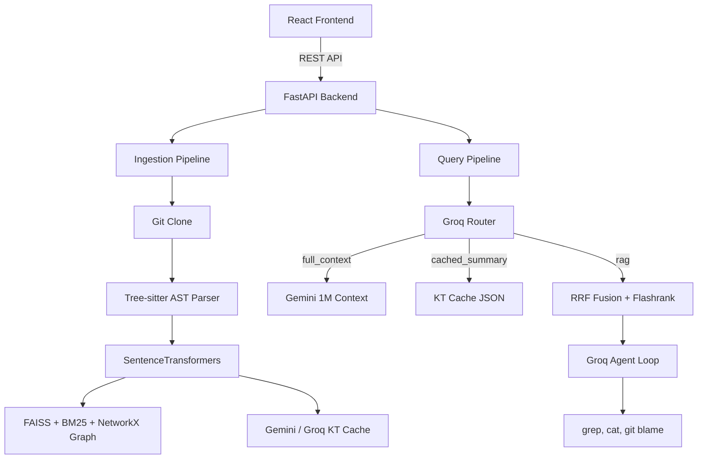

# Codebase Intelligence System - Project Knowledge Base

## Table of Contents
1. [Executive Summary](#1-executive-summary)
2. [High-Level Architecture](#2-high-level-architecture)
3. [Folder Structure](#3-folder-structure)
4. [File-by-File Breakdown](#4-file-by-file-breakdown)
5. [Component Documentation](#5-component-documentation)
6. [Backend Documentation](#6-backend-documentation)
7. [Database Documentation](#7-database-documentation)
8. [Authentication Flow](#8-authentication-flow)
9. [Data Flow](#9-data-flow)
10. [State Management](#10-state-management)
11. [Routing](#11-routing)
12. [API Integrations](#12-api-integrations)
13. [Environment Variables](#13-environment-variables)
14. [Configuration Files](#14-configuration-files)
15. [Dependency Analysis](#15-dependency-analysis)
16. [Feature Documentation](#16-feature-documentation)
17. [Complete User Journey](#17-complete-user-journey)
18. [Business Logic](#18-business-logic)
19. [Error Handling](#19-error-handling)
20. [Security](#20-security)
21. [Performance](#21-performance)
22. [Build Process](#22-build-process)
23. [Known Issues](#23-known-issues)
24. [Future Improvements](#24-future-improvements)
25. [Reverse Engineering Guide](#25-reverse-engineering-guide)
26. [Development Timeline Reconstruction](#26-development-timeline-reconstruction)
27. [Code Quality Audit](#27-code-quality-audit)

---

## 1. Executive Summary

**What this project is:**
The Codebase Intelligence System is a production-grade platform designed for engineers to analyze and query large software repositories using natural language. It acts as a specialized coding assistant that indexes repositories and allows users to chat with their code.

**Why it exists:**
Navigating unfamiliar codebases is time-consuming and challenging for new developers or external engineers. This system accelerates onboarding and debugging by providing high-level architectural summaries, deep technical explanations, and precise code citations.

**Primary Purpose:**
To ingest GitHub repositories, build intelligent indices combining dense and sparse vectors along with knowledge graphs, and provide an agentic RAG (Retrieval-Augmented Generation) loop that answers complex architectural and debugging questions.

**Intended Users:**
- Software Engineers (especially newly onboarded engineers)
- Solutions Architects
- Code Reviewers

**Core Business Value:**
Significantly reduces the time it takes for engineers to understand unfamiliar codebases, thereby improving developer velocity, reducing onboarding time, and making architectural analysis faster.

---

## 2. High-Level Architecture

The system follows a classic decoupled client-server architecture with an agentic backend.



### Key Components
- **Client**: A React application built with Vite, utilizing Zustand for state management and Tailwind CSS for styling.
- **Server**: A Python FastAPI application providing asynchronous REST endpoints.
- **Retrieval Engine**: Combines FAISS (dense vector search) and BM25 (sparse keyword search) using Reciprocal Rank Fusion (RRF). Results are reranked using Flashrank.
- **LLM Integrations**: 
  - **Groq** (`llama-3.3-70b-versatile`): Fast query routing, tech stack inference, and the primary agent loop.
  - **Gemini** (`gemini-2.0-flash`): Heavy lifting for large-context scenarios (e.g., full repo analysis) and bottom-up file summarization.
- **Storage**: File-system-based storage. No external SQL/NoSQL databases. FAISS handles vectors, `pickle` handles BM25 and NetworkX graphs, and JSON handles metadata.

---

## 3. Folder Structure

```text
codebase-intelligence/
├── backend/                  # FastAPI Application
│   ├── agent/                # LLM agent definitions and tools
│   ├── api/                  # FastAPI router definitions
│   ├── ingest/               # Repository ingestion and indexing logic
│   ├── retrieval/            # Query search and ranking algorithms
│   ├── Dockerfile            # Backend container definition
│   ├── benchmark.py          # Script to benchmark RAG accuracy
│   ├── config.py             # Global settings and environment loading
│   ├── main.py               # FastAPI application entrypoint
│   └── requirements.txt      # Python dependencies
├── frontend/                 # React Application
│   ├── public/               # Static assets
│   ├── src/                  # React source code
│   │   ├── api/              # Axios API client
│   │   ├── assets/           # Images/SVGs
│   │   ├── components/       # UI Components
│   │   ├── store/            # Zustand state management
│   │   ├── App.jsx           # Root layout
│   │   └── main.jsx          # React DOM entrypoint
│   ├── index.html            # HTML template
│   ├── package.json          # Node dependencies
│   ├── tailwind.config.js    # Tailwind configuration
│   └── vite.config.js        # Vite bundler configuration
├── docker-compose.yml        # Docker compose definition
├── .env.example              # Environment variables template
└── README.md                 # Project documentation
```

### Important Folders
- **`backend/ingest/`**: Responsible for the offline processing of repositories. Contains cloner, parser, chunker, embedder, and indexer.
- **`backend/agent/`**: Contains the agentic loop that allows the LLM to autonomously use tools if the initial search results are insufficient.
- **`frontend/src/components/`**: Houses all isolated UI elements like the chat window, message bubbles, and repository list.

---

## 4. File-by-File Breakdown

### Backend Files

- **`backend/main.py`**
  - **Purpose**: Entrypoint for the FastAPI server.
  - **Responsibilities**: Initializes the FastAPI app, configures CORS, and includes the `ingest`, `query`, and `repos` routers.
  - **Exports**: `app` (FastAPI instance).

- **`backend/config.py`**
  - **Purpose**: Configuration and rate-limiting management.
  - **Responsibilities**: Loads `GROQ_API_KEY` and `GEMINI_API_KEY` via `pydantic_settings`. Provides a `RateLimiter` class to prevent hitting API quotas. Instantiates global rate limiters `groq_rate_limiter` and `gemini_rate_limiter`.

- **`backend/api/ingest_router.py`**
  - **Purpose**: Handles repository indexing requests.
  - **Flow**: Exposes `/api/ingest`. Validates GitHub URLs, kicks off a background task (`run_ingestion`) to clone the repo, parse AST, embed chunks, build FAISS/BM25 indexes, and generate the Knowledge Transfer (KT) cache.
  - **Dependencies**: `ingest.cloner`, `ingest.parser`, `ingest.embedder`, `ingest.indexer`, `ingest.summarizer`.

- **`backend/api/query_router.py`**
  - **Purpose**: Handles chat queries against repositories.
  - **Flow**: Exposes `/api/query`. Invokes `classify_query` to decide between `full_context`, `cached_summary`, or `rag`. Runs the corresponding pipeline and returns the answer, citations, latency, and tool traces.
  - **Dependencies**: `retrieval.router`, `retrieval.retriever`, `agent.agent`.

- **`backend/api/repos_router.py`**
  - **Purpose**: Manages indexed repositories.
  - **Flow**: Exposes `/api/repos` (GET) and `/api/repos/{repo_name}` (DELETE) to list indexing status and wipe stored indexes/repos from disk.

- **`backend/ingest/chunker.py`**
  - **Purpose**: Data model definition.
  - **Responsibilities**: Defines the `CodeChunk` dataclass used to represent AST nodes (functions, classes) with metadata (imports, calls, variables).

- **`backend/ingest/cloner.py`**
  - **Purpose**: Handles Git operations.
  - **Responsibilities**: Clones repositories to `./repos/` and traverses directories to compile a list of files to process, filtering out `.git`, `node_modules`, and binary directories.

- **`backend/ingest/parser.py`**
  - **Purpose**: High-fidelity AST code parsing.
  - **Responsibilities**: Uses `tree-sitter` (Python, JS, TS, Java, Go, Rust) to parse code into logical `CodeChunk` blocks respecting function/class boundaries. Extracts docstrings, variable assignments, and internal function calls.
  
- **`backend/ingest/embedder.py`**
  - **Purpose**: Vector embedding generation.
  - **Responsibilities**: Uses `SentenceTransformers` (`all-MiniLM-L6-v2`) locally to convert chunk content into floating-point vectors without an external API.

- **`backend/ingest/indexer.py`**
  - **Purpose**: Index construction.
  - **Responsibilities**: Takes embedded chunks and writes them to disk. Creates `chunks_metadata.json`, `index.faiss`, `bm25.pkl` (sparse index), and `graph.pkl` (NetworkX knowledge graph mapping file structure and function calls).

- **`backend/ingest/summarizer.py`**
  - **Purpose**: Precomputes high-level summaries.
  - **Responsibilities**: Generates a Knowledge Transfer (`kt_cache.json`) file using a 3-stage LLM pipeline. Bottom-up summaries of files (Gemini), Pattern recognition for tech stack (Groq), and Top-down synthesis for an onboarding manual (Groq).

- **`backend/retrieval/retriever.py`**
  - **Purpose**: Search engine.
  - **Responsibilities**: Takes a user query, performs FAISS and BM25 searches concurrently. Fuses results using Reciprocal Rank Fusion (RRF), then reranks the top candidates using `Flashrank`. Always injects the repository `README.md` if present.

- **`backend/retrieval/router.py`**
  - **Purpose**: Intelligent query routing.
  - **Responsibilities**: Uses Groq (Llama 3.3) to classify user questions into `full_context`, `cached_summary`, or `rag`. Uses basic heuristic fallbacks for keyword matches.

- **`backend/agent/agent.py`**
  - **Purpose**: Autonomous problem-solving loop.
  - **Responsibilities**: Houses `run_agent_loop`. Provides the Groq LLM with tools and initial RAG context. Parses tool calls, manages context window limits (aggressively truncating history to fit limits), and loops until an answer is generated.

- **`backend/agent/tools.py`**
  - **Purpose**: Agent tool definitions.
  - **Responsibilities**: Implements `expand_context` (reads full file contents), `trace_imports` (uses `grep` to find symbol definitions), and `git_blame` (uses `git log -p` to view file history). Exposes the JSON schema for these tools.

- **`backend/benchmark.py`**
  - **Purpose**: System evaluation.
  - **Responsibilities**: Runs automated tests against the `/api/query` endpoint measuring latency, top-1 accuracy, and top-3 accuracy using predefined cases in `benchmark_cases.json`.

### Frontend Files

- **`frontend/src/main.jsx` & `App.jsx`**
  - **Purpose**: React mount point and layout shell.
  - **Responsibilities**: Sets up the global layout with a sidebar (`RepoList`), a header, an input box (`RepoInput`), and the main chat interface (`ChatWindow`).

- **`frontend/src/store/useStore.js`**
  - **Purpose**: Global state management.
  - **Responsibilities**: Uses `zustand` to manage `repos`, `selectedRepo`, `messages`, `isQuerying`, and `isIngesting`.

- **`frontend/src/api/client.js`**
  - **Purpose**: HTTP wrapper.
  - **Responsibilities**: Creates an Axios instance pointing to `http://localhost:8000/api` and exposes functions mapping to backend routers.

- **`frontend/src/components/ChatWindow.jsx`**
  - **Purpose**: Main conversation interface.
  - **Responsibilities**: Displays messages. Handles form submission, triggers `queryRepo`, formats responses, and auto-scrolls to the newest message. Displays loading animations.

- **`frontend/src/components/MessageBubble.jsx`**
  - **Purpose**: Renders individual chat messages.
  - **Responsibilities**: Differentiates between user and assistant messages. Parses citations (collapsible) and renders agent tool traces if available.

- **`frontend/src/components/CodeBlock.jsx`**
  - **Purpose**: Code visualization.
  - **Responsibilities**: Uses `PrismJS` to provide syntax highlighting for code snippets provided in citations.

- **`frontend/src/components/RepoInput.jsx`**
  - **Purpose**: Ingestion trigger.
  - **Responsibilities**: Accepts a GitHub URL and calls the ingest API, displaying a spinner while the request is dispatched.

- **`frontend/src/components/RepoList.jsx`**
  - **Purpose**: Sidebar navigation and status polling.
  - **Responsibilities**: Lists indexed repositories. Polls `/api/status` every 5 seconds for repos that aren't "ready" to show real-time ingestion progress. Handles repo deletion.

- **`frontend/src/components/ToolCallTrace.jsx`**
  - **Purpose**: Agent transparency.
  - **Responsibilities**: An accordion component using `framer-motion` to display the background tools the LLM used (e.g., `grep`, `git blame`) to arrive at its answer.

---

## 5. Component Documentation

| Component | Purpose | Props | State | Rendering/Lifecycle |
| :--- | :--- | :--- | :--- | :--- |
| **App** | Root layout | None | None | Renders header, sidebar, and main chat area. |
| **ChatWindow** | Chat logic | None | `input` (str), `lastResponse` (obj) | Submits queries, auto-scrolls via `useRef`, maps `messages` array from global store to `MessageBubble`s. |
| **MessageBubble** | Message display | `message` (obj) | `showCitations` (bool) | Framer-motion animation on mount. Conditionally renders `CodeBlock` and `ToolCallTrace`. Styling changes based on `role`. |
| **CodeBlock** | Syntax highlighting | `code`, `language`, `file`, `startLine` | None | Runs `Prism.highlightAll()` on mount/update to parse syntax. |
| **ToolCallTrace** | Debug information | `toolCalls` (array) | `isOpen` (bool) | Collapsible section using `framer-motion`'s `AnimatePresence`. |
| **RepoInput** | URL entry | None | `url` (str) | Controlled input. Triggers ingestion and toggles `isIngesting` global state. |
| **RepoList** | Sidebar | None | None (uses global `repos`) | Sets up a `setInterval` on mount to poll for status. Unmounts interval. Renders clickable cards. |
| **StatusBar** | Global metrics | `lastResponse` (obj) | None | Fixed overlay displaying latency and query mode. |

**Styling Approach:**
Exclusively uses Tailwind CSS utility classes. Relies heavily on `slate` colors for dark mode styling (`bg-slate-950`), and `blue-500`/`blue-600` for primary actions. `framer-motion` is used for micro-animations (fade-ins, collapses).

---

## 6. Backend Documentation

### API Endpoints

1. **`POST /api/ingest`**
   - **Request**: `{ "github_url": "https://github.com/user/repo" }`
   - **Response**: `{ "message": "Ingestion started", "repo_name": "repo" }`
   - **Logic**: Extracts repo name. Adds `run_ingestion` to FastAPI `BackgroundTasks`. Returns immediately.

2. **`GET /api/status/{repo_name}`**
   - **Response**: `{ "status": "cloning|parsing|embedding|indexing|summarizing|ready", "chunk_count": 123 }`
   - **Logic**: Reads `indexes/registry.json`.
   - **Error Handling**: Returns 404 if registry or repo not found.

3. **`POST /api/query`**
   - **Request**: `{ "repo_name": "repo", "question": "How does X work?" }`
   - **Response**: `{ "answer": "...", "mode": "rag", "citations": [...], "tool_calls": [...], "latency_ms": 1500, "tokens_used": 0 }`
   - **Logic**: Classifies query, selects pipeline (`full_context` via Gemini, `cached_summary` from disk, or `rag` via FAISS/BM25 + Agent), measures latency, and returns combined payload.
   - **Error Handling**: Catches exceptions globally, returns a graceful error message indicating failure, bypassing system crash.

4. **`GET /api/repos`**
   - **Response**: `{ "repo1": { ... }, "repo2": { ... } }`
   - **Logic**: Dumps `registry.json`.

5. **`DELETE /api/repos/{repo_name}`**
   - **Response**: `{ "message": "Repo repo1 deleted successfully" }`
   - **Logic**: Uses `shutil.rmtree` to delete `./indexes/{repo_name}` and `./repos/{repo_name}`. Removes entry from `registry.json`.

### Business Logic Modules

- **Authentication**: None. Designed to be run locally or within a trusted intranet.
- **Authorization**: None.
- **Validation**: Basic Pydantic models (`IngestRequest`, `QueryRequest`).
- **Middleware**: `CORSMiddleware` configured to allow all origins (`*`).

---

## 7. Database Documentation

This project deliberately avoids traditional RDBMS/NoSQL databases to remain portable and easy to deploy. It uses a **File System Database**.

### Schemas / File Formats

- **`registry.json`**: Global status tracker.
  - Format: `{ "repo_name": { "status": "ready", "chunk_count": 500 } }`
- **`chunks_metadata.json`**: Acts as the document store. Array of `CodeChunk` dicts.
- **`index.faiss`**: Flat L2 FAISS index holding 384-dimensional vectors from `all-MiniLM-L6-v2`.
- **`bm25.pkl`**: Pickled `BM25Okapi` instance for keyword retrieval.
- **`graph.pkl`**: Pickled NetworkX `MultiDiGraph`. Nodes represent chunks (functions/classes) and files. Edges represent relationships (`contains`, `defines`, `calls`).
- **`kt_cache.json`**: The Knowledge Transfer cache. Contains precomputed file summaries, tech stack analysis, API routes, and the comprehensive "Onboarding Manual".

---

## 8. Authentication Flow

**Not Applicable.** The application currently lacks an authentication flow. It relies on the local environment boundary for security.

---

## 9. Data Flow

### Ingestion Flow
User clicks "Index Repo" → Frontend `POST /api/ingest` → API returns 200 OK.
Background Task Starts:
1. `Git Clone` to `./repos/`.
2. `get_files_to_index` walks directory tree.
3. `parse_file` runs Tree-sitter AST parsing. Extracted chunks are collected.
4. `embed_chunks` generates MiniLM vectors locally.
5. `build_and_save_indexes` writes FAISS, BM25, Metadata, and NetworkX graph to disk.
6. `build_kt_cache` runs async LLM calls (Gemini + Groq) to synthesize an onboarding manual.
7. Registry status set to "ready".

### Query Flow
User types question → Frontend `POST /api/query`.
1. API calls `classify_query` (Groq Llama 3.3).
2. If `rag`:
   - Query embedded via MiniLM.
   - FAISS top 20 + BM25 top 20 fetched.
   - RRF combined scores top 30.
   - Flashrank reranks top 30. Top 6 selected.
   - Agent Loop (Groq) triggered with context.
   - Agent uses tools (`expand_context`, `trace_imports`) if needed.
   - Answer generated.
3. API returns response to Frontend.
4. Frontend maps state, updates chat UI.

---

## 10. State Management

The frontend uses **Zustand** for lightweight global state.

- **`repos`**: Object mapping repo names to their status metadata.
- **`selectedRepo`**: String indicating the currently active repository for queries.
- **`messages`**: Array of message objects `[{role: 'user', content: '...'}, {role: 'assistant', content: '...'}]`.
- **`isQuerying`**: Boolean for UI loading state during LLM inference.
- **`isIngesting`**: Boolean for UI loading state during indexing initiation.

State mutations happen directly via action functions exported in `useStore.js` (e.g., `addMessage`, `updateRepoStatus`).

---

## 11. Routing

### Frontend
- **Single Page Application (SPA)**.
- No client-side router (like react-router) is used. The entire application exists on a single view (`App.jsx`).

### Backend
- `/api/ingest` (POST)
- `/api/query` (POST)
- `/api/repos` (GET)
- `/api/repos/{repo_name}` (DELETE)
- `/api/status/{repo_name}` (GET)

---

## 12. API Integrations

1. **Groq (Llama-3.3-70b-versatile)**
   - **Purpose**: Fast query routing, tech stack inference, complex agent loops requiring tool use.
   - **Configuration**: Requires `GROQ_API_KEY`. Instantiated via `AsyncGroq`.
   - **Limits**: Adheres to strict rate limiting (28 calls/minute) via internal `RateLimiter`. Extreme context truncation is implemented in `agent.py` to avoid 413 Payload Too Large errors on the free tier.

2. **Google Gemini (gemini-2.0-flash)**
   - **Purpose**: Processing massive context. Used for `full_context` queries (can parse millions of tokens of code) and batch summarization for the Knowledge Transfer Cache.
   - **Configuration**: Requires `GEMINI_API_KEY`. Instantiated via `google.generativeai`.
   - **Limits**: Rate limited (14 calls/minute). Used concurrently using `asyncio.Semaphore` in `summarizer.py`.

---

## 13. Environment Variables

- `GROQ_API_KEY`: API key for accessing Groq cloud models. Loaded globally in `config.py`.
- `GEMINI_API_KEY`: API key for accessing Google's Gemini models. Loaded globally in `config.py`.

*Note: The application will immediately exit on startup if these remain set to placeholder values.*

---

## 14. Configuration Files

- **`docker-compose.yml`**: Defines the backend service, exposes port 8000, mounts `./indexes` and `./repos` as volumes for persistence, and injects the `.env` file.
- **`backend/requirements.txt`**: Python dependencies including `fastapi`, `uvicorn`, `groq`, `google-generativeai`, `faiss-cpu`, `sentence-transformers`, `flashrank`, `tree-sitter`, and `gitpython`.
- **`frontend/package.json`**: Node dependencies including `react`, `zustand`, `axios`, `framer-motion`, `prismjs`, and `tailwindcss`.
- **`frontend/tailwind.config.js`**: Standard Tailwind configuration pointing to `src/**/*.{js,jsx}` for content scanning.
- **`frontend/vite.config.js`**: Standard Vite configuration with the React plugin.

---

## 15. Dependency Analysis

- **Tree-sitter**: Crucial for high-fidelity code parsing. Understands syntax trees rather than using arbitrary character splits, improving retrieval accuracy dramatically. *Cannot be easily replaced.*
- **FAISS**: Standard for fast dense vector similarity search. *Replaceable by ChromaDB or Qdrant if scaling is required.*
- **BM25Okapi**: Simple sparse retrieval implementation. Vital for keyword searches where semantic search fails (e.g., exact variable names).
- **Flashrank**: Lightweight Cross-Encoder reranker. Essential for boosting retrieval precision post-RRF fusion.
- **SentenceTransformers**: Runs locally to embed vectors. Eliminates the cost of OpenAI embeddings.

---

## 16. Feature Documentation

### Feature: Intelligent Query Routing
- **Purpose**: To save tokens and time by not running RAG on queries that require high-level project knowledge.
- **Files**: `backend/retrieval/router.py`, `backend/api/query_router.py`
- **Flow**: Intercepts query, evaluates keywords, or uses Groq to output exactly one of `full_context`, `cached_summary`, or `rag`. Redirects execution logic appropriately.
- **Limitations**: Groq free-tier token limitations occasionally cause the router to fail; it defaults to `rag` safely in error states.

### Feature: Agentic Tool Loop
- **Purpose**: Allows the LLM to search for more data if initial RAG context is insufficient.
- **Files**: `backend/agent/agent.py`, `backend/agent/tools.py`
- **Flow**: Exposes `expand_context` (cat), `trace_imports` (grep), and `git_blame` (git log) to the LLM via JSON schema. Enters a `for` loop (max 3 iterations).
- **Limitations**: Context windows grow rapidly. Aggressive character slicing is implemented to prevent API crashes.

---

## 17. Complete User Journey

1. **Launch**: User starts Docker backend and Vite frontend.
2. **Access**: User navigates to `http://localhost:5173`.
3. **Index**: User enters a GitHub URL (e.g., `https://github.com/fastapi/fastapi`).
4. **Wait**: Sidebar shows "cloning", "parsing", "embedding", "indexing", "summarizing" via polling.
5. **Select**: Repo turns green ("ready"). User clicks the repo.
6. **Query**: User types "How is dependency injection implemented?"
7. **Process**: UI shows bouncing dots. Backend routes query to `rag`, retrieves FAISS/BM25 chunks, reranks, queries Agent. Agent uses `grep` tool to trace dependencies. Agent formulates response.
8. **View**: User reads the answer, clicks "View Citations" to read exact source code, and expands "Agent Tool History" to see the agent's thought process.

---

## 18. Business Logic

- **Code Chunking Philosophy**: Do not split by tokens. Split by AST nodes (Classes, Functions). This preserves the logical boundary of the code, making LLM interpretation drastically more accurate.
- **RRF (Reciprocal Rank Fusion)**: Dense embeddings (FAISS) capture semantic meaning. Sparse keywords (BM25) capture exact syntax. They are combined via RRF `(1 / (k + rank))` to provide the best of both worlds.
- **Knowledge Transfer Cache**: Precomputing a massive "Onboarding Manual" during ingestion saves heavy compute during chat time and provides instant answers to "What is this project?"

---

## 19. Error Handling

- **Frontend**: API calls are wrapped in `try/catch`. Displays a generic error message bubble on failure. Defaults to fallback UI states if repo polling fails.
- **Backend APIs**: Global `try/except` in `query_router.py`. If anything fails (LLM crash, parse error), it returns a structured JSON error payload with mode `"error"`, preventing the frontend from breaking.
- **Agent Limits**: If Groq throws `413 Payload Too Large`, the agent catches it, aggressively slices the message context history string to 3000 chars, and attempts to continue.
- **Ingestion Failures**: If AST parsing fails on a file, it catches the exception, prints a warning, and continues indexing the rest of the repo.

---

## 20. Security

- **Authentication**: None.
- **Authorization**: None.
- **Validation**: Minimal Pydantic parsing.
- **XSS**: Handled natively by React's JSX escaping, except where explicitly formatting code blocks.
- **CORS**: `allow_origins=["*"]` is extremely permissive. Suitable for local development only.
- **Command Injection**: High risk in `tools.py` (`trace_imports`). It runs `grep` using subprocess. If `symbol` is maliciously crafted, it could execute arbitrary commands. (e.g. `symbol="a; rm -rf /"`). Currently lacks input sanitization.

---

## 21. Performance

- **Caching**: Heavy reliance on pre-computed `kt_cache.json` for architectural queries.
- **In-memory AI**: `SentenceTransformer` and `Flashrank` models are loaded globally on server start, preventing heavy I/O operations per query.
- **Vector Search**: FAISS `IndexFlatL2` runs entirely in RAM, offering sub-millisecond retrieval times for thousands of chunks.
- **Bottlenecks**: The primary performance bottleneck is LLM latency and rate-limiting artificial delays (`asyncio.sleep()`).

---

## 22. Build Process

- **Backend**: Uses Docker Compose. Builds a Python 3-based container, installs from `requirements.txt`, and runs Uvicorn on port 8000 with hot-reload enabled.
- **Frontend**: Development via `npm run dev` (Vite). Production build would be `npm run build` resulting in a static `dist` folder, though currently undocumented.
- **Storage Persistence**: Volumes are mapped for `./indexes` and `./repos` so data survives container restarts.

---

## 23. Known Issues

- **Security Vulnerability**: Shell command injection possible in `backend/agent/tools.py` via `subprocess.run(["grep", ...])`.
- **API Rate Limiting Instability**: The aggressive truncation of context to bypass Groq API limits destroys historical memory in long agent loops.
- **Memory Leaks**: Large repos might consume excessive RAM since FAISS and BM25 are held entirely in memory per request logic instead of a dedicated vector DB service.
- **Zombie Repos**: If ingestion crashes mid-process, the status in `registry.json` might be permanently stuck on "indexing".
- **Hardcoded Context Paths**: Uses a relative path logic that expects Uvicorn to be run from specific working directories.

---

## 24. Future Improvements

### Current Implementation vs Future Recommendation

- **Current**: Python Subprocess `grep` for tool calls.
  - **Future**: Replace with native Python regex parsing or tree-sitter based symbol querying to eliminate command injection risks.
- **Current**: Flat JSON files and Pickled graphs.
  - **Future**: Migrate to a dedicated vector database (e.g., Qdrant, ChromaDB, or PostgreSQL + pgvector) for scalability and concurrent reads/writes.
- **Current**: Single Page, unauthenticated.
  - **Future**: Introduce Clerk or Supabase Auth. Add multi-user support where users have their own private indices.
- **Current**: Blocking agent loops.
  - **Future**: Implement WebSockets for streaming agent thoughts and LLM tokens directly to the UI in real-time.

---

## 25. Reverse Engineering Guide

*If the repository is deleted, here is how to rebuild it from scratch.*

### Core Architectural Philosophy
Do not build a naive RAG system (splitting text by 1000 characters). You must build an **AST-based RAG**. 
1. Use `tree-sitter` bindings for Python, JS, TS, Go, Java, and Rust.
2. Traverse the AST and extract nodes of type `function_definition` and `class_definition`.
3. Save these exact string blocks as your "chunks".

### The 3-Tier Router
Implement an LLM router (very small system prompt) that looks at a user query and returns `rag`, `full_context`, or `cached_summary`.
- If `full_context`: Read the entire repo from disk into a single massive string. Send to Gemini 1.5/2.0 Pro.
- If `cached_summary`: Read a pre-generated `kt_cache.json` summary.
- If `rag`: Execute the Retrieval Pipeline.

### The Retrieval Pipeline
1. You need a local embedder. Use `sentence-transformers/all-MiniLM-L6-v2`.
2. Build two indexes: FAISS (L2 distance) for the vectors, and BM25 for the raw text.
3. When querying, get Top 20 from FAISS and Top 20 from BM25.
4. Implement Reciprocal Rank Fusion (RRF). Formula: `Score = 1 / (60 + Rank)`. Sort by combined score.
5. Take the top 30 from RRF and pass them to a Cross-Encoder (like `Flashrank`). Get the definitive Top 6.

### The Agentic Loop
Provide the LLM with the Top 6 chunks and JSON Schema for tools.
The tools must include:
- `expand_context(file_path)`: Reads the entire file.
- `trace_imports(symbol)`: Runs `grep` across the codebase to find where a variable/class is defined.
Loop the LLM. If it returns tool calls, execute them, append the result to the messages array, and call the LLM again. Cap at 3 iterations.

### Frontend
- Build a Vite/React SPA.
- Use `zustand` to hold `{ repos, messages, selectedRepo }`.
- Run a `setInterval` every 5 seconds to GET `/api/repos` and update indexing status in the UI.
- Use `framer-motion` to smoothly animate in new messages and expand tool call traces.

---

## 26. Development Timeline Reconstruction

*Best-effort reconstruction based on architecture and comments.*

1. **Phase 1: Basic RAG (Inferred)**
   - Initial implementation likely started with naive text splitting, FAISS, and simple question-answering.
2. **Phase 2: AST Integration (Inferred)**
   - The developer realized standard RAG hallucinates heavily on code. `tree-sitter` was introduced (`ingest/parser.py`) to split strictly by function/class boundaries.
3. **Phase 3: Hybrid Search & Agent (Inferred)**
   - Accuracy wasn't high enough. BM25 and Flashrank were bolted onto the retrieval pipeline (`retrieval/retriever.py`).
   - LLMs still lacked context, so the Groq Agent Loop was built to allow the LLM to run `grep` and `cat`.
4. **Phase 4: Optimization & Cost Reduction (Inferred)**
   - Groq API rate limits (HTTP 429/413) forced the creation of `config.py` `RateLimiter` and the aggressive context truncation logic in `agent.py`.
5. **Phase 5: Knowledge Transfer Cache (Inferred)**
   - Realized that answering "what is this project" via RAG is terrible. Built the `summarizer.py` to precompute the onboarding manual using Gemini.

---

## 27. Code Quality Audit

- **Dead Code**: The `graph.pkl` (NetworkX graph) is generated during indexing but is only vaguely utilized in `summarizer.py` and completely ignored during RAG retrieval.
- **Complex Files**: `backend/agent/agent.py` contains deeply nested try/catch blocks handling specific string-matching errors from the Groq API (e.g., checking for "413"). This is fragile and tightly coupled to Groq's error messaging.
- **Error Swallowing**: Many bare `except:` or `except Exception:` blocks exist in `parser.py` and `query_router.py` that simply `pass` or `print`, hiding potentially critical failures.
- **Missing Documentation**: Backend code lacks type hinting in several places and has almost no inline docstrings for complex logic like the RRF fusion algorithm.
- **High Coupling**: The backend logic hardcodes relative paths like `./repos/` and `./indexes/`. Running the app from anywhere other than the `codebase-intelligence` root will crash it.
